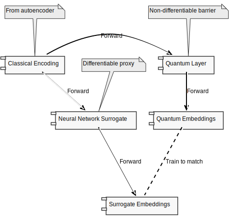
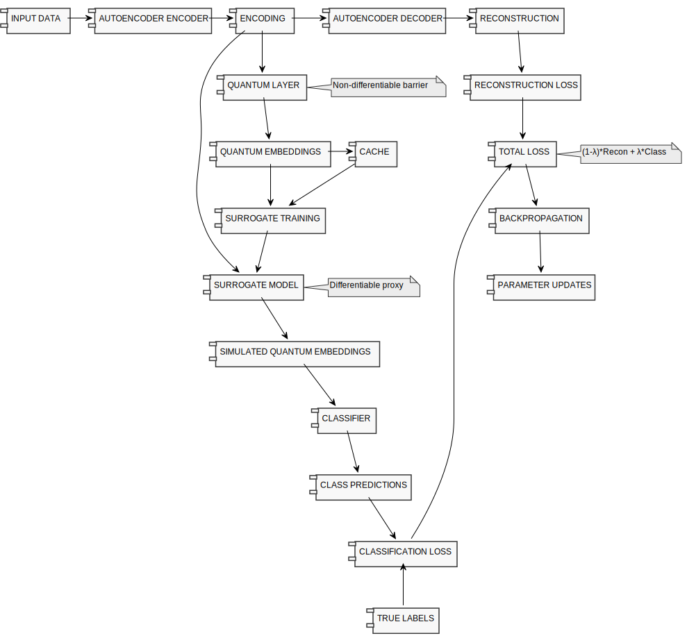

# Neutral Atom QGARS (Quantum Guided Autoencoder with Reservoir Surrogate)

## Project Overview

Neutral Atom QGARS is a quantum-classical hybrid system that leverages neutral atom quantum processors for image classification tasks. The system combines quantum reservoir computing (QRC) with classical deep learning techniques and introduces two key innovations: quantum guided autoencoders and quantum surrogate models to address the challenges of gradient-based training in quantum-classical hybrid architectures.

## Key Improvements

### Classical Autoencoder vs PCA

Traditional dimensionality reduction techniques like Principal Component Analysis (PCA) have several limitations when dealing with complex image data:

- **Linearity**: PCA is a linear transformation and cannot capture complex non-linear patterns in the data
- **Scalability**: PCA becomes computationally intensive with high-dimensional inputs
- **Fixed Transformation**: PCA lacks flexibility to adapt based on downstream tasks

Autoencoders address these limitations by:

- **Non-linearity**: Capturing complex patterns through non-linear activation functions
- **Adaptability**: Learning representations that minimize reconstruction error rather than just maximizing variance
- **Flexibility**: Supporting architectural variations like convolutional layers for image data
- **End-to-end Training**: Allowing for joint optimization with downstream tasks

### Quantum Guided Autoencoder

While standard autoencoders optimize solely for reconstruction quality, the Quantum Guided Autoencoder optimizes for both reconstruction AND quantum classification performance. This creates several advantages:

- **Task-Specific Encodings**: Generates encodings that work particularly well with quantum processing
- **End-to-End Quantum-Classical Pipeline**: Establishes gradient flow between quantum outputs and classical inputs
- **Enhanced Performance**: Achieves better classification accuracy compared to standard autoencoders
- **Quantum Advantage Targeting**: Directs the feature learning toward regions where quantum processing excels

The total loss function for the Quantum Guided Autoencoder combines reconstruction loss and classification loss:

$\mathcal{L}_{\text{total}} = (1-\lambda) \cdot \mathcal{L}_{\text{reconstruction}} + \lambda \cdot \mathcal{L}_{\text{classification}}$

Where:

- $\lambda$ is the guided_lambda parameter (0-1) that balances the two loss components
- $\mathcal{L}_{\text{reconstruction}}$ is the Mean Squared Error (MSE) between input and reconstruction:
  $\mathcal{L}_{\text{reconstruction}} = \frac{1}{N} \sum_{i=1}^{N} (x_i - \hat{x}_i)^2$
- $\mathcal{L}_{\text{classification}}$ is the Cross-Entropy loss for classification:
  $\mathcal{L}_{\text{classification}} = -\frac{1}{N} \sum_{i=1}^{N} \sum_{j=1}^{C} y_{ij} \log(\hat{y}_{ij})$

### The Quantum Surrogate Model Problem

A key challenge in quantum-classical hybrid learning is the non-differentiable nature of quantum operations. When we want to use the classification loss to guide the autoencoder's learning:

1. Classical autoencoder produces an encoding
2. Quantum layer processes this encoding to produce quantum embeddings
3. A classifier uses these embeddings for prediction

**The Gradient Barrier Problem**: Gradients cannot flow back from the classification loss to the autoencoder because:

- Converting classical data to quantum states is non-differentiable
- Quantum measurements break the computational graph
- Classical gradients cannot propagate through the quantum layer

### Our Solution: The Surrogate Approach

We solve this by creating a differentiable surrogate model that mimics the quantum layer:

## Quantum Reservoir Computing with Neutral Atoms

Our system leverages neutral atom arrays as a quantum reservoir for information processing. Quantum reservoirs provide a powerful computational framework that can exploit quantum dynamics for machine learning tasks.

### Rydberg Hamiltonian and Quantum Dynamics

The quantum reservoir is governed by the Rydberg atom Hamiltonian:

$H(t) = \dfrac{\Omega(t)}{2}\sum_j (\ket{g_j}\bra{r_j}+\ket{r_j}\bra{g_j})+ \sum_{j<k}V_{jk}n_jn_k-\sum_j [\Delta_{\mathrm{g}}(t) + \alpha_j\Delta_{\mathrm{l}}(t)] n_j$

Where:

- $\Omega(t)$ is the global Rabi drive amplitude between ground state $\ket{g_j}$ and Rydberg state $\ket{r_j}$
- $n_j=\ket{r_j}\bra{r_j}$ is the Rydberg state projector for atom $j$
- $V_{jk}=C/\lVert\mathbf{r}_j-\mathbf{r}_k\rVert^6$ describes the van der Waals interactions between atoms
- $\Delta_{\mathrm{g}}(t)$ is the global detuning term applied to all atoms
- $\Delta_{\mathrm{l}}(t)$ is the local detuning term with site-specific modulation $\alpha_j \in [0,1]$

### Data Encoding Schemes

Currently, we use local detuning encoding where the autoencoder's output is mapped to the $\alpha_j$ coefficients that modulate the local detuning term. This encoding scheme allows us to imprint input data patterns onto the quantum system's energy landscape.

Future extensions of this work will explore additional encoding schemes:

1. **Spatial encoding**: Mapping data to atom positions in the array
2. **Rabi encoding**: Modulating the Rabi drive amplitude for each atom
3. **Mixed encoding**: Combinations of detuning, spatial, and Rabi encodings

### Quantum Readout Methods

We support multiple types of quantum observables as readouts from the system:

1. **Single-atom measurements** ($\langle Z_i \rangle$): Expectation values of the Z operator for each atom $i$, representing the population difference between ground and Rydberg states.
   $\langle Z_i \rangle = \langle \psi | Z_i | \psi \rangle = P(|g_i\rangle) - P(|r_i\rangle)$
2. **Two-atom correlations** ($\langle Z_i Z_j \rangle$): Two-body correlations between all pairs of atoms $i$ and $j$.
   $\langle Z_i Z_j \rangle = \langle \psi | Z_i Z_j | \psi \rangle$
3. **Three-atom correlations** ($\langle Z_i Z_j Z_k \rangle$): Three-body correlations between atom triplets $i$, $j$, and $k$.
   $\langle Z_i Z_j Z_k \rangle = \langle \psi | Z_i Z_j Z_k | \psi \rangle$

These readout options can be selected via the `readout_type` parameter:

- `"Z"`: Only single-atom measurements
- `"ZZ"`: Both single-atom and two-atom correlations
- `"all"`: Complete set including single-atom, two-atom, and three-atom correlations

The richness of these quantum correlations provides a high-dimensional feature space that can capture complex patterns in the input data, offering potential quantum advantage for classification tasks.

## Complete Pipeline Architecture 

## Key Benefits

1. **Training Efficiency**: Requires fewer quantum simulations through surrogate modeling
2. **Improved Learning**: Classification loss effectively guides autoencoder learning
3. **Better Quantum Features**: Encodes features that work well with quantum processing
4. **Performance**: Better classification accuracy compared to non-guided approaches
5. **Flexibility**: Works with various quantum configurations and datasets

## License

This project is licensed under the GNU General Public License v3.0 (GPL-3.0) - see the [LICENCE](LICENCE) file for details.
